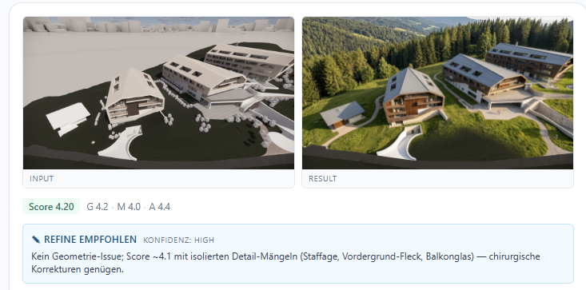
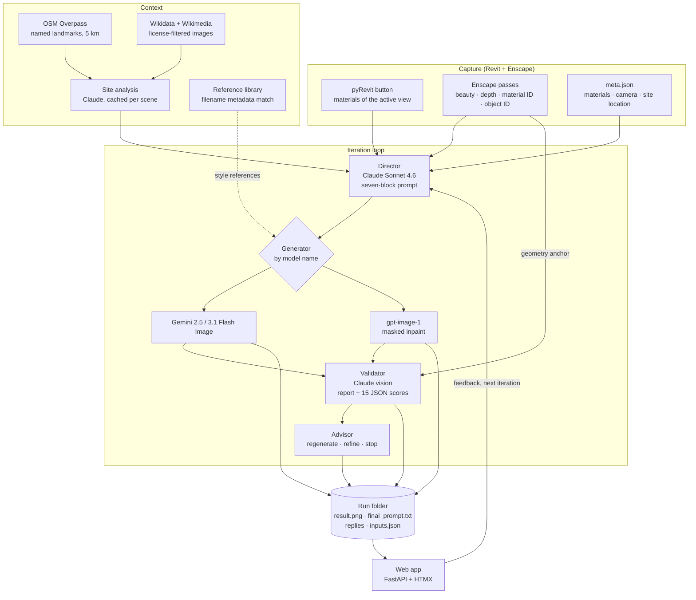
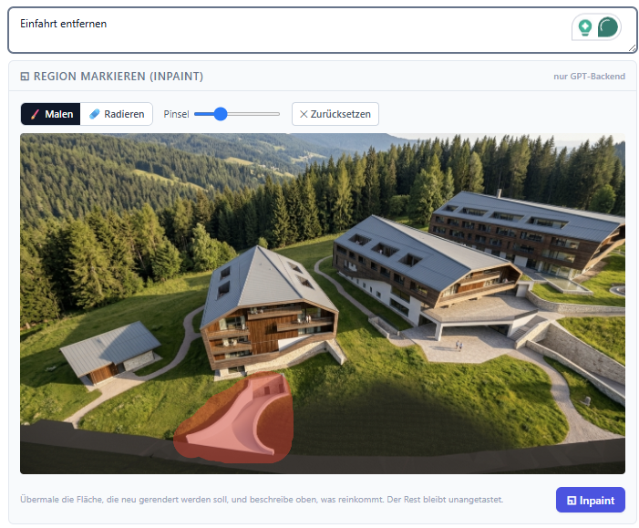
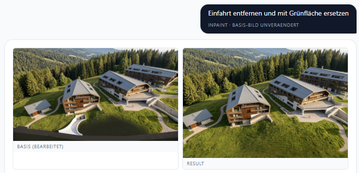
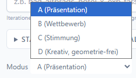
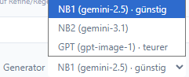
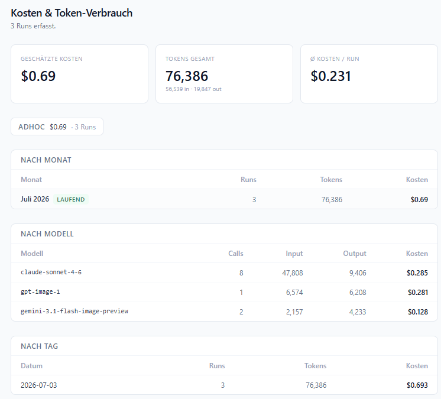
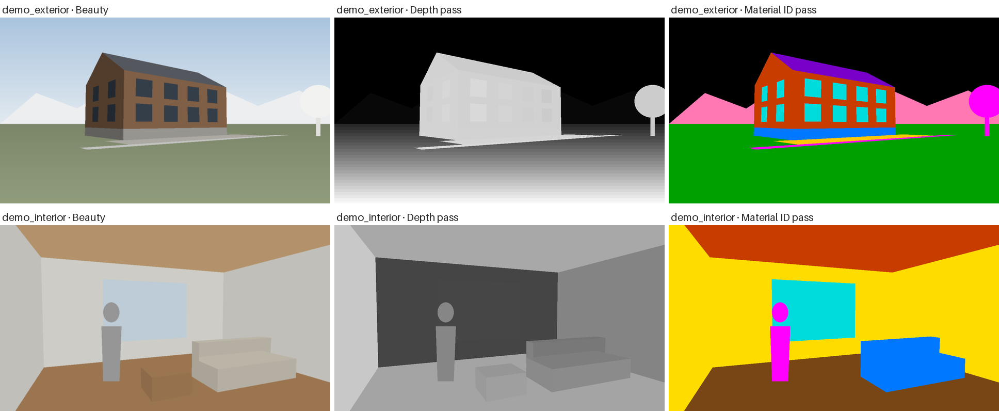

# Render Director

Turns a raw BIM render into a photorealistic visualization without letting the
model redesign the building. Claude writes the image prompt from the render and
what Revit knows about it, an image model generates, a second Claude call scores
the result against the original geometry, and a third recommends the next move.
The architect decides; the loop only makes that decision cheap.

Python 3.11 · FastAPI · HTMX · Anthropic · Google GenAI · OpenAI · pyRevit

> **What it does not do.** It does not touch the BIM model, does not trigger the
> Enscape render, and does not pick the mode for you. It cannot guarantee
> geometry: it measures drift and tells you about it, which is a weaker promise
> than "geometry-safe" and the honest one. And it does not claim its own output
> is good — the validator is a model judging a model, not a ground truth.



*One iteration from a test run in a design process: the Enscape raw render on
the left, still full of white placeholder volumes, the generated result on the
right. Below it the
validator's 15 sub-scores condensed to 4.20 and the advisor's call — refine, not
regenerate, because nothing is wrong with the geometry. The UI is German.*

### Start here

Four files carry most of what is interesting, if you only have a few minutes:

| File | Why |
|---|---|
| [`prompts/director_system.md`](prompts/director_system.md) | The seven-block prompt contract. The geometry lock that may never be shortened, the rule that Enscape's white volumes are software defaults rather than design, and a fixed output shape that the next iteration can diff against. |
| [`src/render_director/pipeline.py`](src/render_director/pipeline.py) | Four provider calls, three anchor strategies (original render, previous result, previous result plus mask), and the two-phase split that shows the image before the judgement exists. |
| [`src/render_director/utils.py`](src/render_director/utils.py) | Where model text becomes data: prompt extraction, advisor parsing, the 1–5 score schemas and their aggregation — all of it without an SDK import, so it stays testable. |
| [`src/render_director/mock_providers.py`](src/render_director/mock_providers.py) | The offline providers that let the whole application — and 71 tests — run with no API key and no network. |

```bash
git clone … && uv sync && uv run pytest                    # 71 tests, no key needed
RENDER_MOCK_PROVIDERS=1 RENDER_SNAPSHOT_ROOT=examples/scenes \
  uv run uvicorn app.main:app --port 8765                  # the real UI, canned model replies
```

---

## Contents

- [Architecture](#architecture)
- [The loop](#the-loop) — anchors, iteration types, the two-phase split
- [Prompt architecture](#prompt-architecture) — the seven blocks, modes, what testing changed
- [Evaluation](#evaluation) — two score layers, and what they do not prove
- [Provider orchestration](#provider-orchestration) — model per role, cost, failure paths
- [Location context](#location-context) — OSM, Wikidata, and a license filter
- [Reference library](#reference-library)
- [Revit integration](#revit-integration)
- [Getting started](#getting-started)
- [Project layout](#project-layout)
- [Tests](#tests)
- [Design decisions](#design-decisions)
- [Limitations](#limitations)

---

## Architecture



Two things in that picture are deliberate. **The ID passes stop at the vision
models.** Their colours are arbitrary region labels, and a generator would
happily render them as the actual colours of the building, so the director and
the validator see them and the generator never does. **The advisor does not see
the director's reasoning.** It gets the two images and the validator report,
nothing else, so it cannot inherit the director's conviction that the prompt was
right.

---

## The loop

One iteration is four calls and one folder on disk.

| Iteration type | Generator anchor | Director |
|---|---|---|
| `initial` | original render (plus depth) | full prompt from metadata and request |
| `regenerate` | original render (plus depth) | revised prompt, previous result and validator report as input |
| `refine` | previous result | revised prompt, wording shifted to "maintain, only adjust" |
| `inpaint` | previous result plus mask | skipped — the user's sentence *is* the prompt |

The anchor choice is the whole game. `regenerate` keeps geometry honest because
the model starts from the BIM render again, but throws away everything that had
already converged. `refine` keeps the atmosphere and risks drift. That trade-off
is what the advisor exists to decide, and why it is a separate call rather than a
sentence at the end of the director's answer: the director had just argued for
its own prompt.

Inpainting skips the director entirely. The mask already localises the edit, so
a seven-block prompt would only add noise around a sentence like "remove the
driveway and replace it with grass".

<p align="center">
  
  
</p>

*Mask painted over the driveway, and the result: only the marked region is
regenerated, everything outside it stays as it was. The validator is told this
was a masked edit, so it does not start criticising the parts nobody touched.*

**The two-phase split.** `run_iteration(..., defer_validation=True)` returns as
soon as the image is on disk. The UI shows it, then fetches validator and
advisor in a second request through `finalize_iteration()`. Both entry points
call the same validation helper, so the deferred path cannot drift from the
direct one. Waiting for three more model calls before showing an image the user
is already curious about is the kind of latency that makes a tool feel dead.

---

## Prompt architecture

The prompts are checked in as Markdown, read from disk on every call, and are
the part of this repo worth reading first.

### Seven blocks, two of them load-bearing

Every image prompt the director writes has the same shape:

```
[SCENE TYPE & CAMERA]        camera, lens, perspective
[GEOMETRY LOCK]              hard constraint: do not move, add or remove anything
[MATERIALS]                  from the BIM material list, not from the picture
[LIGHTING & ATMOSPHERE]      the negotiable part
[ENVIRONMENT & CONTEXT]      what replaces Enscape's placeholder volumes
[STAFFAGE]                   people, furniture, life
[STYLE REFERENCE]            photographic register
[NEGATIVE CONSTRAINTS]       what must not happen
```

The fixed shape is what makes iterations comparable: two runs on the same scene
differ in the blocks the director chose to change, and that diff is readable.

Shortening prompts uniformly turned out to cause drift, so the blocks are split
into fixed and soft. Geometry lock and negative constraints are never shortened.
Lighting is fixed in mode A, because that mode's entire promise is a warm,
inviting image and the generator drifted into cold winter light without it. In
interior iterations the floor material line is carried over verbatim even when
nobody complained about it — dropping it made the generator fall back to a
default CGI floor.

### The modes are chosen, not classified



Four modes, picked by the architect before the run: **A** client presentation,
**B** competition, **C** mood exploration, **D** free exploration. They change
how the director behaves — A asks at most one clarifying question, B asks for the
concept first, C returns three contrasting variants, D replaces the geometry lock
with an exploration block.

Classifying the mode from the request was possible and would have been worse. The
mode decides whether the building may change shape. That is not a question a
model should answer silently on someone's behalf.

### Placeholders are not design

Enscape renders unmodelled context — neighbouring buildings, trees, terrain,
mountains — as white volumes. A generator reads them as architecture. §4a of the
director prompt names each class and what replaces it, and the validator scores
whether it happened (`weisse_placeholder_ersetzt`). The exception is explicit:
when `meta.json` marks the grey volumes as real OpenStreetMap neighbours, they
stay.

### Keeping the machine-parsed parts stable

The conversation is German or Italian; the image prompt is always English. A
per-role language directive states what must not be translated: the English
prompt and the `FORWARD_ATTACHMENTS` token for the director, the JSON keys for
the validator, the `ACTION` / `GRUND` / `KONFIDENZ` labels and their tokens for
the advisor. Localisation that breaks a parser is a silent failure, so the
protected parts are named in the prompt that could break them.

### Attachments pass through a gate

A user can attach up to three images per turn. The director always sees them and
describes them in words. It may also forward one to the generator by emitting
`FORWARD_ATTACHMENTS: [1]` — a deliberate decision, because every extra input
image dilutes the generator's attention on the geometry anchor.

### The regional default is a parameter

The prompts carry `{{DEFAULT_REGION}}`, substituted at load time from
`RENDER_DEFAULT_REGION` (default: `Alpenraum`). Regional assumptions — which
vegetation, which mountain character, which light — are a setting, not a
hardcoded landscape.

---

## Evaluation

The validator answers twice, to two different readers.

**Layer 1, for the architect:** five sections — geometry and composition,
materials, requirements, one to three concrete edit instructions, and what
worked — each of the first three rated ✓ / ⚠ / ✗.

**Layer 2, for the pipeline:** a JSON block with 15 sub-scores from 1 to 5, or
`null` where a dimension is not visible in the image.

| Section | Exterior sub-scores |
|---|---|
| `geometrie` | massing · proportions · window axes and doors · roof shape · completeness · **composition fidelity** |
| `material` | facade · roof · windows · ground |
| `anforderung` | atmosphere · time of day · staffage · mode fit · placeholders replaced |

Interior scenes use their own schema (room proportions, wall surfaces, ceiling
height, openings, built-ins; wall, ceiling, floor, furniture, reveals).

Three levels were the first attempt and too coarse: different detail problems all
ended up as "⚠" at section level, so an iteration could not be told from noise.
The 1–5 block fixed that, and `null` matters as much as the numbers — a scene
without placeholder volumes must not be scored on replacing them.

**Composition fidelity is a separate sub-score** because it catches the failure
mode that looks like success: an image can be beautiful, plausible, and contain a
mountain range that is not in the model. Regional plausibility is explicitly not
a defence.

The advisor's stop rule reads those scores: no ✗ issues and a mean at or above
4.3 for exterior, 4.5 for interior. Its prompt lists the loopholes it may not
use — no stopping because the trend improved, because 4.2 is "almost", or because
the next iteration costs money.

Scores are written into each run's `inputs.json` next to the token usage, so a
run explains its own quality and its own price without parsing Markdown.

---

## Provider orchestration



| Role | Model | Why this one |
|---|---|---|
| Director, validator, advisor, site analysis | Claude Sonnet 4.6 | long structured instructions, vision, and a judgement that has to stay parseable |
| Generator (default) | Gemini 2.5 Flash Image | cheapest per image, image-conditioned |
| Generator | Gemini 3.1 Flash Image (preview) | optional thinking budget, off / dynamic |
| Generator, inpainting | gpt-image-1 | the only one of the three with native mask support |

The backend is selected by model name inside `call_generator`, per iteration, from
a dropdown. Masks are refused for the Gemini backends with a message naming the
one that works, rather than being silently ignored.

**Cost is tracked, not estimated afterwards.** Every call records its token
counts from the SDK response; a single price table turns them into dollars.
Tokens are exact, costs are an estimate, and the code says so where it matters.



*Real numbers from three ad-hoc runs: $0.69 total, about $0.23 per run, split by
model. gpt-image-1 costs roughly as much for one image as Claude does for eight
calls — which is exactly the kind of fact that should be visible in the tool
rather than on an invoice.*

Two smaller decisions with a large effect on that number: images for Claude are
capped at 1024 px on the long edge, which roughly halves vision input tokens for
judgements that do not need more; and the generator always gets full resolution,
because that is where the pixels end up.

**Failure paths are handled where they happen**, because all of them look like
success otherwise:

- The generator returns no image (safety filter): raised with the model name.
- The director asks a clarifying question instead of producing a prompt: its
  reply is shown as an error bubble in the chat, which in mode B is expected
  behaviour rather than a bug.
- The director's reply was cut off by the token limit: told apart from the
  question case by an unbalanced code fence, so the fix (raise `max_tokens`) is
  obvious instead of mysterious.
- Provider budget and rate-limit errors are classified and shown as a readable
  sentence in the user's language.
- The site analysis fails: logged, and the run continues without it.

---

## Location context

For exterior scenes with coordinates, the pipeline builds a short regional
characterisation once per scene and caches it as `site_analysis.md`:

1. **OSM Overpass** returns named features within 5 km — peaks with elevation,
   water, villages, alpine huts — as deterministic text.
2. **Wikidata SPARQL** finds the curated lead image for those places. Commons
   geosearch fills the gap when there are too few, filtered by a blacklist that
   exists because geotagged Commons photos in valleys are dominated by railway
   enthusiasts and satellite imagery.
3. **Claude** turns both into five short sections: vegetation, topography,
   light character, architectural context, and anti-patterns — what must *not*
   appear in the render.

The OSM names are the truth in that prompt; the images are mood only. The
director is told not to write a named landmark it cannot derive from the data.

**The license filter is part of the design.** Only CC0, public domain and CC BY
images are stored locally. Share-alike images are used for the vision call and
then dropped — they never reach disk, never reach the generator, and the cache
header logs every source with its license for attribution. OSM data is ODbL, and
the render that comes out of this is not a derivative of the photos, because the
photos never touch the generator.

---

## Reference library

A folder of curated project photos, with the metadata in the file name:

```
projecta_005_hotel_woodglass_day_corner_close.jpg
        │   │     │         │   │      └── distance
        │   │     │         │   └───────── angle
        │   │     │         └───────────── time of day
        │   │     └─────────────────────── material compound
        │   └───────────────────────────── building type, the parser's anchor
        └───────────────────────────────── project
```

Tier 0 is a metadata match, not an embedding: the German BIM material text is
mapped to a controlled vocabulary (`Lärchenholz` → `wood`, `Sichtbeton` →
`concrete`), matched on material overlap with time of day as a secondary signal,
and the top-k selection prefers different projects so two references are not two
views of the same building.

It augments and never overrides: if the architect already forwarded their own
references, the library adds nothing. Which photos went along is recorded in
`inputs.json`, because "why does this look like that" is a question that gets
asked a week later.

Embeddings were the original plan and are still the obvious next tier. Tag
matching was one afternoon's work and answered whether retrieval helps at all,
which is the question that decides whether a vector store is worth its weight.

---

## Revit integration

A pyRevit button exports the active view and opens the web app on it:

- **Materials of the visible elements**, collected through the view's element
  collector rather than the whole model — tens of materials instead of
  thousands, with shading colour, class and appearance asset per material.
- **`meta.json`** with project info, camera parameters and the site location
  from `doc.SiteLocation`, converted from radians and feet. Lat/lon of exactly
  0/0 is treated as "not set" rather than as a point in the Atlantic.
- **The Enscape files are moved, not copied**, so the export folder does not
  slowly fill with duplicates. The beauty file is the critical move and raises on
  failure; the passes are best-effort and logged.
- **Idempotent**: the same view exports into the same folder through a view index
  next to the project, and a complete snapshot offers to open instead of
  re-exporting.

The launcher is shared with the desktop shortcut: it pings `/health`, starts
uvicorn in the background if nothing answers, and opens Chrome in app mode on
the right half of the screen, next to Revit.

---

## Getting started

Requirements: Python 3.11+ and [uv](https://docs.astral.sh/uv/).

```bash
git clone https://github.com/thilo-h/render-director.git
cd render-director
uv sync
```

The repo ships two synthetic scenes, so everything runs without BIM data:



*Drawn by [`scripts/make_demo_assets.py`](scripts/make_demo_assets.py) with a
small pinhole projection — convex bodies, back-face culling, near-plane
clipping. The white volumes imitate what Enscape leaves behind, and beauty,
depth and material ID come out of the same polygons, so the passes actually
agree with each other.*

Without API keys, against canned model replies:

```bash
RENDER_MOCK_PROVIDERS=1 RENDER_SNAPSHOT_ROOT=examples/scenes \
  RENDER_REFERENCE_LIBRARY_ROOT=examples/reference_library \
  uv run uvicorn app.main:app --port 8765
```

The mock providers return director, validator and advisor replies in exactly the
shape the parsers expect, and hand back the input image colour-graded and stamped
`MOCK`, so a mock result can never be mistaken for a real one. Inpaint mocks
respect the mask. The header shows a `Mock` badge while the flag is on.

With real providers, copy `.env.example` to `.env` and set `ANTHROPIC_API_KEY`
and `GOOGLE_API_KEY`; `OPENAI_API_KEY` is only needed for the GPT backend and
inpainting. One iteration from the command line, writing to
`RENDER_GENERATIONS_ROOT`, `--generations-root` or `data/generations/`:

```bash
uv run python -m render_director.pipeline examples/scenes/demo_exterior "Warm late morning, two people at the entrance"
```

On Windows next to Revit, `install.cmd` creates the environment and asks for the
keys, and `tools/launcher/Render Director.cmd` starts the app.

---

## Project layout

```
prompts/                     system prompts, read from disk on every call
  director_system.md         exterior: seven blocks, modes, geometry lock
  director_interior_system.md interior: light profiles per program, furniture state
  director_adhoc_system.md   vision-only, no BIM
  validator_*.md             three validators, three score schemas
  director_advisor_system.md regenerate / refine / stop, with anti-loophole rules
src/render_director/
  pipeline.py                the loop, anchors, run folders, CLI
  prompts.py                 prompt loading, user-message templates, language directives
  utils.py                   scene loader, parsers, score schemas and aggregation
  clients.py                 lazy SDK clients, mock switch
  mock_providers.py          offline Anthropic / Google / OpenAI stand-ins
  usage.py                   token capture and the price table
  geo/                       Overpass · Wikidata · Wikimedia · site analysis
  rag/library.py             tier-0 reference matching
app/                         FastAPI + HTMX: chat UI, ad-hoc rail, cost page
tools/
  pyrevit_export/            Revit button: materials, meta.json, pass handling
  launcher/                  health check, uvicorn, Chrome app window
examples/                    synthetic scenes and reference library
scripts/make_demo_assets.py  draws the demo scenes
tests/                       70 offline tests
docs/                        architecture · prompt design · evaluation
```

---

## Tests

```bash
uv run pytest        # 71 tests, no API key, no network
```

Every test runs against the mock providers; `conftest.py` also marks the `.env`
as loaded so a local key file cannot leak into a test run and change behaviour.
The same command runs in CI ([`.github/workflows/ci.yml`](.github/workflows/ci.yml))
with no key in the environment, which is the point: a suite that needed one
could not pass there.

| Area | What the tests pin |
|---|---|
| parsers | the first code block wins; a truncated reply is told apart from a question; malformed JSON returns `None` rather than zeros |
| scores | `null` is excluded from means, not counted as zero; unexpected keys survive flattening; interior and exterior schemas stay apart |
| prompts | no unresolved placeholder in any of the seven prompts; the geo block appears only for exterior scenes with coordinates; attachment numbering follows the passes that exist |
| scene loading | pass suffixes match case- and separator-insensitively; two candidates for one pass fail loudly; a pyRevit export adapts to the internal schema |
| reference library | filename parsing including the positional fallback; material overlap required, time of day secondary; project diversity in the top-k |
| end to end | all six run artifacts exist; the usage block lists four roles in order; a refine run records its parent; deferred validation merges into one usage block |
| inpaint | opaque mask areas come back pixel-identical, transparent ones do not; a mask on a Gemini backend raises |
| web app | every page renders; the mock badge appears only with the flag |

Two of these tests exist because writing them found a bug. The material
vocabulary matched `alu` inside `Schalung`, so a larch facade counted as metal —
short needles now match at word boundaries, long ones still match inside German
compounds. And the app refused to start when the configured run folder did not
exist yet, because `StaticFiles` checks at mount time while the folder was
only created at startup.

What no test here shows is whether the renders are any good. See
[Limitations](#limitations).

---

## Design decisions

**Hosted APIs, not self-hosted diffusion.** Flux with ControlNet is the
technically better answer to geometry fidelity: depth, canny and segmentation
maps are hard constraints, and the material ID pass maps directly onto a
segmentation input. It was specified in detail and not built, because it needs
GPU infrastructure that a per-user local tool does not have, and because the
first question was whether a director–validator loop produces usable images at
all. A hosted Flux endpoint fits behind `call_generator` as another backend
whenever that trade-off changes.

**A style LoRA was dropped for the same reason.** Training on an office's own
photo library would make house style a parameter instead of an adjective. It
needs a GPU, a curated corpus and a training loop; the reference library is the
cheap approximation that answers whether style references help at all.

**The filesystem is the database.** One run is one folder with the image, the
prompt, three replies and `inputs.json`. It survives the app, it can be copied
to a colleague, and the chat history is rebuilt from it. A real database becomes
right when several architects work in parallel, and that was never the case here.

**Per user, not per office.** Each workstation runs its own instance next to
Revit. No server to operate, no shared state to corrupt, and project images stay
on the machine they came from.

**Prompts as files, not strings.** Editing a Markdown file and re-running is the
whole loop for tuning. It also means the prompts are reviewable in a pull request
like any other source.

**German prompts, English image prompts.** The users are German-speaking
architects; the generators perform better in English. The seam is one directive
per role, and the parsers are protected by name.

---

## Limitations

- **No image-quality evaluation.** The validator is a model scoring a model.
  There is no labelled set, no human ratings to correlate against, and no
  measurement of whether a 4.4 render is actually better than a 3.9 one. The
  scores make iterations comparable; they do not prove quality. A few dozen
  human-rated pairs would change that and are the next thing worth building.
- **Validator self-consistency is unmeasured.** One fixed image, N validator
  calls, look at the spread — a cheap experiment that has not been run.
- **Geometry drift is detected, not prevented.** The geometry lock is a sentence
  in a prompt. Hard constraints need ControlNet, see above.
- **Sampling is expensive.** Comparing two prompt variants at three samples each
  costs twelve model calls, which is why the comparisons here are small.
- **The mock replies are invented, not recorded.** They exercise parsing, run
  artifacts and cost arithmetic faithfully, and say nothing about model quality.
- **Windows-bound in the last mile.** The launcher and installer assume Windows,
  Chrome and pyRevit. The pipeline, the web app and the tests are
  platform-independent.
- **The pyRevit script is untested in this state.** It has no Revit on the other
  side of a test run; the changes in it are small and mechanical, but they are
  unverified.
- **The screenshots are test runs, not demo data.** The scenes in `examples/`
  are synthetic; the screenshots come from iterations made while testing the
  tool in a design process, which is why their UI is German.

---

## License

MIT — see [LICENSE](LICENSE). Copyright is held under the GitHub handle
`thilo-h`.
