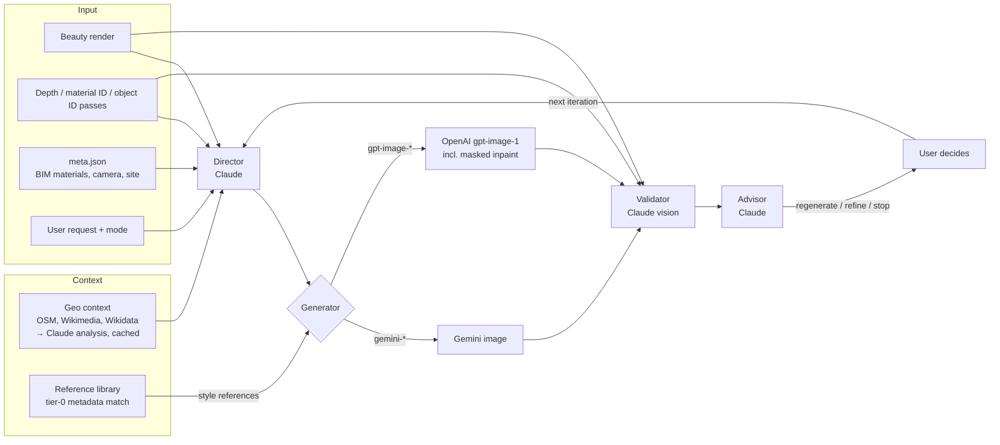

# Architecture

The system turns a raw architectural render (typically an Enscape export
from Revit) plus a short natural-language request into a photorealistic
image, and keeps iterating on it with a validator in the loop.

It has three entry points that share one pipeline package:

| Entry point | Where | Used for |
|---|---|---|
| Web app (FastAPI + htmx) | `app/` | Conversational iteration, cost dashboard, ad-hoc image upload |
| CLI | `python -m render_director.pipeline` | Single iteration as a smoke test |
| pyRevit button + launcher | `tools/` | Export a view from Revit and open the web app on it |

## Pipeline



One iteration (`run_iteration` in `src/render_director/pipeline.py`):

1. **Load the scene bundle** (`utils.load_scene_bundle`): beauty image,
   optional passes, validated `SceneMetadata`. Exports from the pyRevit
   button are adapted on load.
2. **Geo context** (exterior scenes with coordinates): fetch named
   landmarks from OSM Overpass and license-filtered images from
   Wikimedia/Wikidata, let Claude write a short regional characterisation,
   cache it as `site_analysis.md` next to the scene. Failures are logged
   and the run continues without it.
3. **Director**: Claude gets the beauty render, ID passes, metadata, geo
   context and the request, and returns a short explanation plus an
   English image prompt in a fixed seven-block format. For iterations it
   also gets the previous prompt, the previous result and the validator
   report. It can forward up to three user attachments to the generator
   (`FORWARD_ATTACHMENTS: [..]`).
4. **Reference library** (optional): matching photos are added as style
   references for the generator, never overriding what the user attached.
5. **Generator**: the backend is chosen by model name.
   - `initial` / `regenerate`: start from the beauty render (plus depth).
   - `refine`: edit the previous result.
   - `inpaint`: previous result plus a mask, gpt-image only, director
     skipped.
6. **Validator**: Claude vision compares the result with the beauty
   render and returns a report for humans plus a JSON score block for the
   pipeline (see [evaluation.md](evaluation.md)).
7. **Advisor**: a separate, tightly constrained Claude call recommends
   `regenerate`, `refine` or `stop` with a confidence. It sees the
   validator report and both images, not the director's reasoning, so it
   cannot inherit the director's bias.

### Two-phase UI

`defer_validation=True` returns right after the image is saved. The web
app shows the image immediately and loads validator and advisor output in
a second request (`finalize_iteration`). Both paths call the same
validation helper, so there is no duplicated logic.

### Two rails: snapshot and ad-hoc

- **Snapshot** (`run_iteration`): BIM-backed, with metadata, passes and an
  interior/exterior switch that selects prompts and score schema.
- **Ad-hoc** (`run_iteration_adhoc`): any single image (render, model
  photo, sketch), vision-only, with optional site photo, pin and
  coordinates. Same validator/advisor loop, same score schema.

## Provider layer

| Role | Provider | Default model | Why |
|---|---|---|---|
| Director | Anthropic | `claude-sonnet-4-6` | Strong vision + instruction following for long structured prompts |
| Validator | Anthropic | `claude-sonnet-4-6` | Same model family judges the output against the input |
| Advisor | Anthropic | `claude-sonnet-4-6` | Short, parseable three-line decision |
| Site analysis | Anthropic | `claude-sonnet-4-6` | Summarises OSM data and images into regional guidance |
| Generator NB1 | Google GenAI | `gemini-2.5-flash-image` | Cheap default for image-conditioned generation |
| Generator NB2 | Google GenAI | `gemini-3.1-flash-image-preview` | Optional thinking budget |
| Generator GPT | OpenAI | `gpt-image-1` | Native mask support for inpainting, high input fidelity |

- `clients.py` creates each SDK client lazily and caches it, so importing
  the package does not pay the SDK start-up cost.
- `usage.py` records tokens for every call and estimates cost from a
  single price table. Each run stores a `usage` block in `inputs.json`;
  the web app aggregates it on the cost page.
- Images sent to Claude are downscaled to 1024 px on the long edge
  (`utils.CLAUDE_VISION_MAX_EDGE`), which roughly halves vision input
  tokens. The generator always gets full resolution.
- Material and object ID passes go to the director and validator only.
  A generator would render their label colours as real colours.

### Mock providers

`RENDER_MOCK_PROVIDERS=1` swaps all three SDK clients for
`mock_providers.py`. The mocks return director, validator and advisor
replies in exactly the format the parsers expect, and an output image
stamped `MOCK`. Inpaint mocks respect the mask. The geo step skips
network calls. This powers the demo and the end-to-end tests.

## Run artifacts

Every iteration writes a self-contained folder:

```
data/generations/<phase_label>/<Scene>/<timestamp>_<scene>_mode<M>_run<NN>_<NB1|NB2|GPT>/
├── result.png
├── final_prompt.txt       # prompt exactly as sent to the generator
├── director_reply.md
├── validator_reply.md
├── advisor_reply.md
├── attachment_NN.png      # if the user attached images
└── inputs.json            # request, models, iteration tree, scores, usage
```

`inputs.json` links iterations through `iteration.type` and
`parent_run_id`, so the web app can rebuild the chat history from disk.

## Configuration

All settings are environment variables (see `.env.example`):

| Variable | Default | Purpose |
|---|---|---|
| `ANTHROPIC_API_KEY`, `GOOGLE_API_KEY`, `OPENAI_API_KEY` | – | Provider keys (OpenAI optional) |
| `RENDER_MOCK_PROVIDERS` | off | Run without keys |
| `RENDER_DEFAULT_REGION` | `Alpenraum` | Regional default context in director prompts |
| `RENDER_HTTP_CONTACT` | – | Contact in the User-Agent for OSM/Wikimedia |
| `RENDER_SNAPSHOT_ROOT` | `data/scenes` | Scene folders |
| `RENDER_GENERATIONS_ROOT` | `data/generations` | Run folders (web app and CLI) |
| `RENDER_PHASE_LABEL` | `runs` | Sub-folder to separate test series |
| `RENDER_REFERENCE_LIBRARY_ROOT` | `data/reference_library` | Reference photos |
| `RENDER_ADHOC_ROOT` | `~/Documents/Render Director` | Ad-hoc sessions |

## Deployment model

The tool runs per user on a local Windows workstation next to Revit:
`install.cmd` creates the virtual environment and asks for keys,
`tools/launcher/launch.py` starts uvicorn on demand and opens Chrome in
app mode on the right half of the screen. There is no shared server, no
database and no GPU; run folders on disk are the source of truth.
